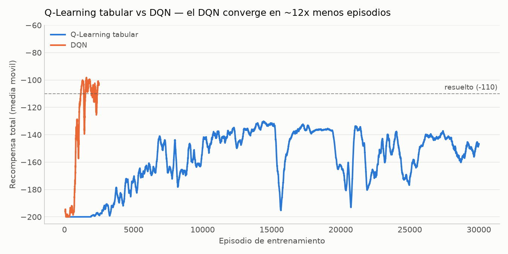
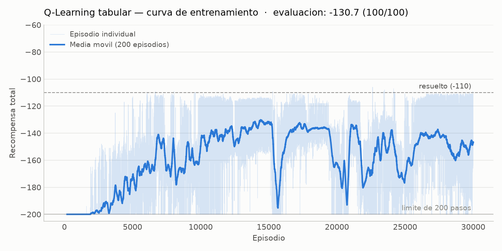
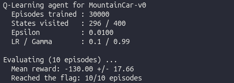
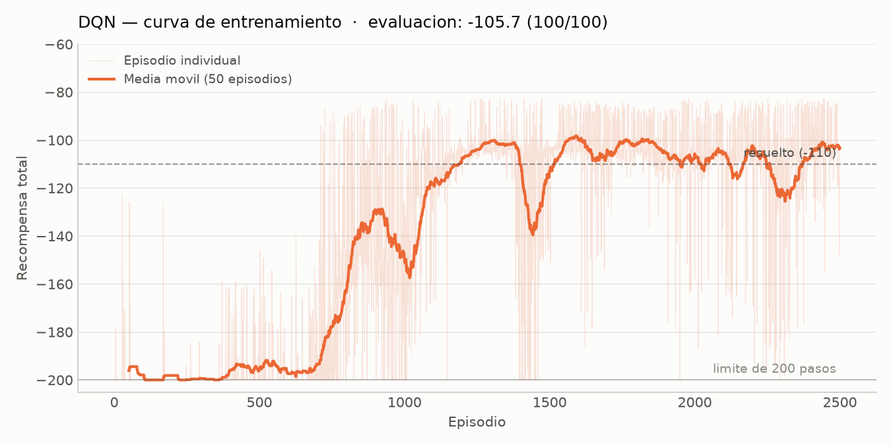
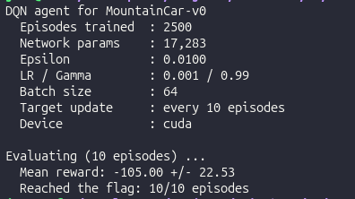
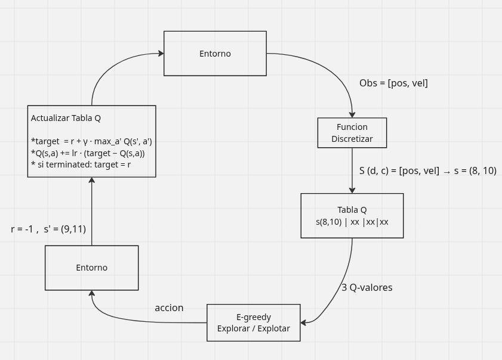
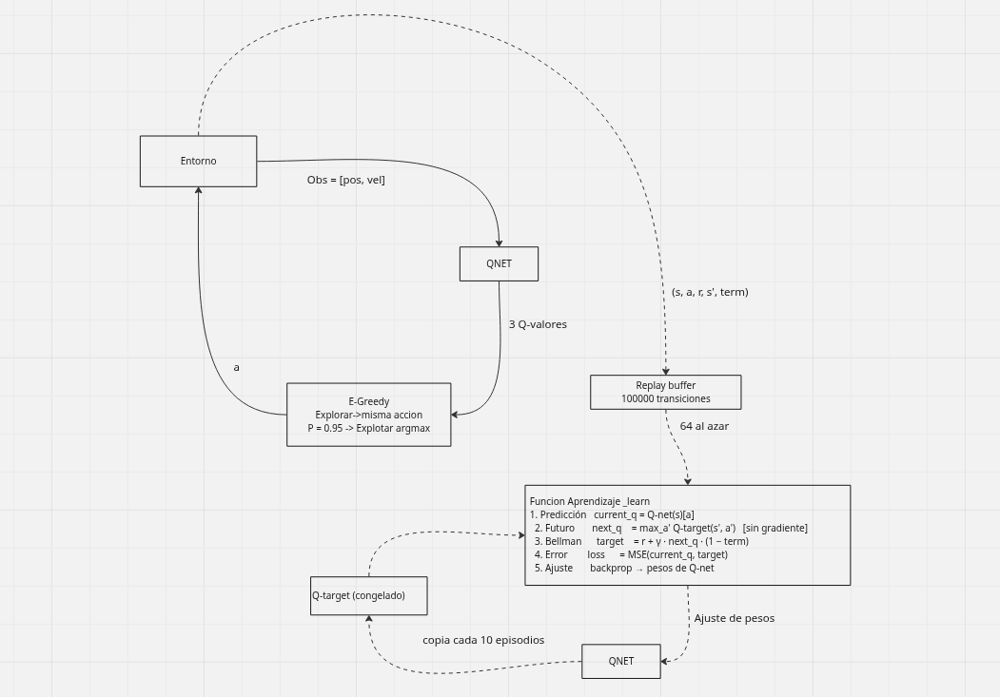

# MountainCar-v0: Q-Learning tabular vs DQN

Implementación y comparación de dos enfoques de Aprendizaje por Refuerzo sobre
**MountainCar-v0**: un agente Q-Learning tabular con discretización del espacio de
estados y un agente Deep Q-Network.

El trabajo consistió en completar las partes marcadas como `EXERCISE` en el
repositorio base ([EXERCISES.md](EXERCISES.md)): la discretización, la política
ε-greedy y la actualización TD del agente tabular; la red y el paso de aprendizaje
del DQN; y el diagnóstico y corrección del fallo de exploración que impide que el
DQN aprenda en este entorno.

## Resultados

| Agente | Episodios entrenados | Recompensa media (100 eps) | Mejor | Peor | Llegó a la meta |
|---|---:|---:|---:|---:|---:|
| Q-Learning tabular | 30.000 | **−130.69** ± 18.83 | −109 | −169 | 100/100 |
| DQN | 2.500 | **−105.72** ± 21.32 | −83 | −176 | 100/100 |

El DQN supera el umbral convencional de resuelto (−110) usando 12 veces menos
episodios.



---

## El entorno

Un carro con motor insuficiente parte del fondo de un valle y debe alcanzar una
bandera en `x = 0.5`. No puede subir de frente: tiene que oscilar acumulando
momento.

| | |
|---|---|
| Estado | 2 valores continuos: posición (−1.2 a 0.6) y velocidad (−0.07 a 0.07) |
| Acciones | 3 discretas: acelerar izquierda, no acelerar, acelerar derecha |
| Recompensa | −1 por paso, sin excepciones |
| Corte | 200 pasos |

El retorno total es el negativo de la duración del episodio: **−200** si nunca
llega, **−110** es el umbral convencional de resuelto, menos negativo es mejor.

Dos consecuencias de esa recompensa condicionan todo lo que sigue. No existe
gradiente de recompensa que apunte hacia la meta, así que el agente debe alcanzar la
bandera por exploración antes de poder aprender algo. Y la única señal informativa
del entorno son las transiciones terminales, que anclan el objetivo de Bellman en un
valor exacto en lugar de una estimación.

### Punto de referencia

El enunciado describe el patrón que resuelve el entorno y lo llama *movimiento de
bombeo*: empujar a la derecha mientras se mueve a la derecha, empujar a la izquierda
mientras se mueve a la izquierda, en rachas largas y sostenidas
([EXERCISES.md](EXERCISES.md), Clue 1). Como regla escrita a mano son dos
operaciones:

```python
accion = 0 if velocidad < 0 else 2      # empuja en la dirección del movimiento
```

Medido sobre el entorno:

| Estrategia | Posición máxima | Resultado |
|---|---:|---|
| siempre a la derecha | −0.2968 | nunca llega (−200) |
| movimiento de bombeo | +0.5099 | **llega en 122 pasos (−122)** |
| política aleatoria (300 episodios) | −0.1956 | **0 de 300 llegan** |

El −122 sirve de referencia: es lo que consigue quien ya conoce la física del
problema. El `0/300` reaparece en el Ejercicio 3 como causa del fallo del DQN.

---

## Instalación y uso

Requiere [uv](https://docs.astral.sh/uv/) y Python 3.11 (fijado en
`.python-version`; `pyproject.toml` exige `>=3.11,<3.12`).

```bash
git clone https://github.com/JFMontenegro/mountain_car.git
cd mountain_car
uv sync
```

No hace falta activar el entorno: `uv run <comando>` usa el `.venv` del proyecto.

```bash
uv run mountaincar <comando>
```

| Comando | Qué hace |
|---|---|
| `inspect` | espacios de estado/acción y transiciones de ejemplo |
| `train <agente> --episodes N` | entrena; retoma el save si existe |
| `load <agente> --eval` | info del agente y evaluación de 10 episodios |
| `sim <agente> --episodes N` | episodios con salida paso a paso |
| `render <agente>` | episodios en ventana gráfica |
| `delete <agente>` | borra el save |
| `list` | agentes disponibles y estado de sus saves |

`<agente>` es `qlearning` o `dqn`.

### Reproducir los resultados

```bash
uv run mountaincar train qlearning --episodes 30000     # ~70 s
uv run mountaincar load qlearning --eval

uv run mountaincar train dqn --episodes 2500            # ~3 min
uv run mountaincar load dqn --eval
```

## Ejercicio 1: Q-Learning tabular

Archivo: [`src/mountain_car/agents/qlearning.py`](src/mountain_car/agents/qlearning.py)

El espacio de observación se discretiza en una grilla de 20×20 con `np.digitize`
sobre los límites que publica el entorno, de modo que cada celda es un estado de la
tabla Q. Las funciones implementadas son `discretize`, `select_action` (ε-greedy con
modo determinista) y `_update` (actualización TD).

| Parámetro | Valor |
|---|---|
| `n_bins` | 20 por dimensión → 400 celdas |
| `lr` | 0.1 |
| `gamma` | 0.99 |
| `epsilon` | 1.0 → 0.01, ×0.9995 por episodio |

### Política aprendida

De las 400 celdas el agente visitó 296; las restantes son combinaciones de posición y
velocidad que el carro no puede alcanzar. Revisando la acción greedy celda por celda,
la política sigue una regla única: con velocidad negativa empuja a la izquierda, con
velocidad positiva empuja a la derecha. Es el movimiento de bombeo, alcanzado sin más
información que recompensas de −1 idénticas. La coincidencia con ese patrón es del
**79 %**; el resto son celdas visitadas muy pocas veces donde el valor Q todavía es
ruido.

### Resultado



**−130.69 ± 18.83 sobre 100 episodios, 100/100 alcanzando la meta. Mejor episodio:
−109.**



La curva se mantiene en −200 hasta el episodio 1.621, el primero que alcanza la
bandera. Antes de eso todas las recompensas son idénticas y no hay nada que aprender;
después la señal se propaga hacia atrás desde la meta.

Lo más relevante de la curva son los **tres desplomes** en los episodios ~15.500,
~20.700 y ~25.000, donde el agente cae de −133 a cerca de −195 antes de recuperarse.
Dos factores lo explican. El learning rate se mantiene constante en 0.1, de modo que cada visita sigue moviendo el valor un 10 % indefinidamente y la
tabla nunca se asienta. Y con ε en el piso de 0.01 la política se estrecha a una
franja angosta de celdas: las demás dejan de actualizarse, sus valores quedan
obsoletos, y cualquier desvío hacia ellas bootstrapea sobre información vieja.

Esa inestabilidad motivó extender el entrenamiento a 30.000 episodios en vez de los
20.000 sugeridos. Una evaluación hecha justo después de un desplome arroja −160; una
hecha en meseta, −131. El valor reportado corresponde al estado final del agente.

---

## Ejercicio 2: Deep Q-Network

Archivo: [`src/mountain_car/agents/dqn.py`](src/mountain_car/agents/dqn.py)

Se reemplaza la tabla por un MLP que recibe el estado continuo sin discretizar y
devuelve un Q-valor por acción:

```
[x, v] → Linear(2,128) → ReLU → Linear(128,128) → ReLU → Linear(128,3)
```

| Parámetro | Valor |
|---|---|
| optimizador | Adam, `lr = 1e-3` |
| `gamma` | 0.99 |
| `batch_size` | 64 |
| capacidad del buffer | 100.000 |
| sincronización de la target net | cada 10 episodios |
| `epsilon` | 1.0 → 0.01, ×0.995 por episodio |
| `sticky_prob` | 0.95 *(ver Ejercicio 3)* |

El replay buffer y la target network vienen implementados en el repositorio base. El
paso de aprendizaje es lo implementado aquí:

```python
all_q = self.q_net(states_t)
current_q = all_q.gather(1, actions_t)                              # (64,1)

with torch.no_grad():
    q_target = self.target_net(next_states_t)
    next_q = q_target.max(dim=1, keepdim=True).values                # (64,1)

target_q = rewards_t + self.gamma * next_q * (1.0 - terminateds_t)   # (64,1)
loss = self.loss_fn(current_q, target_q)                             # nn.MSELoss

self.optimizer.zero_grad()
loss.backward()
self.optimizer.step()
```

`gather` recupera, de las tres salidas de la red, la columna correspondiente a la
acción que realmente se ejecutó. El `max` se toma sobre `target_net` y bajo
`torch.no_grad()`, de modo que el objetivo no propaga gradientes.

La multiplicación por `(1.0 - terminateds_t)` reemplaza al `if terminated:` del
agente tabular, que no es aplicable porque el lote mezcla transiciones terminales y
no terminales: donde el flag vale 1 el factor se hace cero, el término futuro
desaparece y el objetivo queda anclado en la recompensa.

Antes de entrenar se verificó que `current_q` y `target_q` tengan ambos forma
`(64,1)`. Si difieren, PyTorch hace broadcast sin lanzar excepción y la red entrena
sobre valores sin sentido.

---

## Ejercicio 3: Diagnóstico del fallo de exploración

Con los ejercicios 1 y 2 correctos, el DQN sobre MountainCar reporta
`Avg Reward: -200.00` de forma indefinida. No es inestabilidad ni aprendizaje lento. Es un problema de diseño.

### Verificar que el algoritmo funciona

El agente no está especializado en MountainCar, así que puede ejecutarse sobre un
entorno que DQN resuelve con certeza:

```bash
uv run python -c "
from mountain_car.agents.dqn import DQNAgent
DQNAgent('CartPole-v1', epsilon_decay=0.98).train(total_episodes=200, log_interval=25)"
```

```
Episode  25/200 | Avg Reward:  18.16
Episode 100/200 | Avg Reward: 187.16
Episode 200/200 | Avg Reward: 394.68
```

De 18 a 394 sin modificar una línea. `QNetwork` y `_learn` son correctos: el problema
es específico de MountainCar.

### revisando el buffer

Un episodio que no alcanza la bandera produce 200 recompensas de −1 y ninguna
transición terminal. Mil episodios producen lo mismo, así que el buffer completo
queda con 100.000 filas idénticas en recompensa y en `terminated`.

Eso importa porque la única información real que entra al aprendizaje son las
transiciones terminales: son las que anclan el objetivo en un valor exacto (−1) en
vez de una estimación de la propia red. Sin ellas, el entrenamiento consiste en
comparar estimaciones contra estimaciones.

### Medir la frecuencia del evento

```
Política 100 % aleatoria, 300 episodios:
  llegaron a la bandera : 0 / 300
  posición máxima vista : -0.1956   (la meta está en 0.5)
```

Cero de 300, y en 60.000 pasos la posición máxima no alcanzó ni la mitad del camino.
El agente nunca observó el evento que debe aprender a causar.

### Por qué no cambia el valor

El movimiento de bombeo requiere rachas sostenidas de la misma acción, del orden de
20 empujones seguidos. La exploración ε-greedy estándar extrae una acción uniforme
nueva en cada paso, con lo que las acciones consecutivas son independientes:

```
P(la misma acción 20 veces seguidas) = (1/3)²⁰ ≈ 3 en 10.000 millones
```

En 60.000 pasos el número esperado de rachas así es 0,000017. Y una sola no bastaría:
para que los Q-valores dejen de ser todos iguales, el agente tendría que encadenar
esa secuencia improbable hasta llegar a la bandera, y volver a lograrlo en episodios
posteriores las veces suficientes para que la señal se propague por el resto del
espacio de estados.

La red, entonces, aprendió correctamente: aprendió que ninguna acción importa, lo
cual es cierto dados los datos que recibió. El fallo no está en el aprendizaje sino
en cómo se recolectan los datos.

Por eso el problema no se resuelve entrenando más. Hay que cambiar la forma en que el
agente explora, de modo que el movimiento de bombeo sea un comportamiento que la
exploración pueda producir por sí sola: que las acciones consecutivas dejen de ser
independientes y pasen a estar **temporalmente correlacionadas**.

### Corrección

Solo cambia la elección de las acciones exploratorias. No se modifica la regla de
aprendizaje, la recompensa ni el entorno.

```python
if not deterministic and np.random.random() < self.epsilon:
    if self._last_explore_action is None or np.random.random() >= self.sticky_prob:
        self._last_explore_action = np.random.randint(0, self.action_dim)
    return self._last_explore_action
```

Se conserva la última acción exploratoria y se repite con probabilidad
`sticky_prob = 0.95`; solo el 5 % de las veces se sortea una nueva.
`_last_explore_action` se reinicia al comienzo de cada episodio y `sticky_prob` está
en `_HPARAMS` para que sobreviva a `save`/`load`.

La dirección de la exploración sigue siendo aleatoria: no se programa el movimiento
de bombeo, solo se hace que las rachas sostenidas sean alcanzables.

| | ε-greedy uniforme | exploración correlacionada |
|---|---:|---:|
| racha promedio | 1,5 pasos | **31,2 pasos** |
| alcanza la bandera solo explorando | **0 / 300** | **15 / 100** |
| posición máxima | −0.1956 | **+0.5416** |
| uso de las 3 acciones | uniforme | uniforme (7002 / 6204 / 6794) |

Sin entrenamiento alguno y con ε = 1.0, el evento pasa de imposible a ocurrir el 15 %
de las veces. La racha promedio de 31,2 supera los 20 de `1/(1−p)` porque al
resortear puede volver a salir la misma acción, lo que prolonga la racha: la longitud
esperada real es `1/(1−p−(1−p)/3) = 30`.

### Resultado



**−105.72 ± 21.32 sobre 100 episodios, 100/100 alcanzando la meta. Mejor episodio:
−83.**



El primer episodio que alcanza la bandera es el número **5**, frente al 1.621 del
agente tabular. La diferencia no está en el algoritmo de aprendizaje sino en la
exploración. La media móvil permanece plana hasta el episodio ~700 porque al
principio los éxitos son escasos y el promedio sigue dominado por los episodios que
agotan los 200 pasos; después sube y cruza el umbral de resuelto en el episodio
1.189, estabilizándose entre −100 y −110 con un único bache cerca del episodio 1.450.

El registro de entrenamiento se ve peor que la evaluación, y es esperable: aun con ε
en 0.01, cuando la exploración se activa secuestra el control durante unos 30 pasos
seguidos en vez de uno. Un episodio de entrenamiento paga ese costo varias veces; la
evaluación, greedy pura, no lo paga. La exploración correlacionada es a la vez lo que
hace el entrenamiento más ruidoso y lo que lo hace posible.

El mejor episodio de −83 queda por debajo del movimiento de bombeo escrito a mano
(−122): en los arranques favorables la red aprovecha la posición exacta del carro
para salir del valle en menos oscilaciones.

---

## Comparación


| Criterio | Q-Learning tabular | DQN |
|---|---|---|
| Desempeño final | −130.69 ± 18.83 | **−105.72 ± 21.32** |
| Mejor episodio | −109 | **−83** |
| Primer éxito | episodio 1.621 | **episodio 5** |
| Cruza −110 en promedio | nunca | **episodio 1.189** |
| Episodios necesarios | 30.000 | **2.500** |
| Estabilidad | tres desplomes de −133 a −195 tras converger | un bache; estable desde el episodio 1.500 |
| Tamaño del modelo | 296 celdas × 3 = 888 valores (18 KB) | 17.283 pesos (211 KB) |
| Interpretabilidad | la política se puede leer celda por celda | 17.283 pesos opacos |
| Garantías teóricas | convergencia demostrada | ninguna |

**Estabilidad.** Es la diferencia más visible y va en dirección contraria a lo
esperado: el método clásico resultó el inestable. El agente tabular colapsa tres
veces después de haber convergido, por el learning rate constante y el estrechamiento
de la política al bajar ε. El DQN, pese a carecer de garantías, se mantiene entre
−100 y −110 una vez que llega; el replay buffer y la target network existen
precisamente para eso y aquí cumplen.

**Velocidad.** El DQN alcanza mejor desempeño con 12 veces menos episodios, por
generalización: ajustar los pesos para una trayectoria modifica la predicción de
todos los estados vecinos, de modo que un solo éxito enseña sobre una región
completa. En la tabla, un éxito solo actualiza las celdas exactas visitadas.

**Desempeño.** La diferencia de ~25 pasos proviene de la discretización: el agente
tabular no distingue puntos dentro de una misma celda de la grilla, así que a veces
empuja un poco tarde o un poco temprano. Contra la referencia de −122 del movimiento
de bombeo, el DQN la supera y el tabular no.

**Dificultad de implementación.** El agente tabular es claramente más simple: tres
funciones cortas, sin tensores, y cualquier error se detecta imprimiendo la tabla. El
DQN es más difícil porque sus errores son silenciosos: un desajuste de formas, usar
`q_net` en lugar de `target_net` u omitir `torch.no_grad()` no lanzan excepción y el
programa reporta números plausibles. Pero la mayor dificultad no estuvo en ninguno
de los dos algoritmos sino en el Ejercicio 3, donde todo el código es correcto y el
fallo surge de la interacción entre la estrategia de exploración y la estructura de
recompensa del entorno. Ese tipo de fallo no se encuentra leyendo el código, sino
midiendo qué datos está viendo el agente.

### Ventajas y limitaciones

**Q-Learning tabular.** Convergencia garantizada, política completamente
interpretable, sin dependencias pesadas ni hiperparámetros de red. En contra:
requiere discretizar, lo que introduce error de aproximación; no generaliza, así que
cada celda se aprende por separado; y el número de celdas crece exponencialmente con
la dimensión del estado, lo que lo vuelve inviable más allá de 3 o 4 dimensiones.

**DQN.** Trabaja sobre el estado continuo sin pérdida de precisión, generaliza entre
estados vecinos, de ahí su eficiencia en datos, y escala a espacios de alta
dimensión. En contra: sin garantías de convergencia, sujeto a olvido catastrófico,
requiere replay buffer y target network solo para ser estable, es prácticamente
imposible de inspeccionar y tiene muchos más hiperparámetros que ajustar.

---

## Esquemas del proceso de entrenamiento

**Q-Learning tabular**



**DQN**



---

## Estructura del proyecto

```
src/mountain_car/
├── cli.py                  # CLI con argparse, una función por comando
└── agents/
    ├── qlearning.py        # Q-Learning tabular (ejercicio 1)
    └── dqn.py              # QNetwork, ReplayBuffer, DQNAgent (ejercicios 2 y 3)
results/                    # curvas, capturas de evaluación, historiales, métricas
saves/                      # agentes entrenados
docs/                       # esquemas del ciclo de entrenamiento
EXERCISES.md                # enunciado original de los ejercicios
```

## Créditos

Repositorio base del curso:
[emiliomunozai/mountain_car](https://github.com/emiliomunozai/mountain_car). Las
implementaciones de los ejercicios 1, 2 y 3, y este documento
son trabajo propio.
